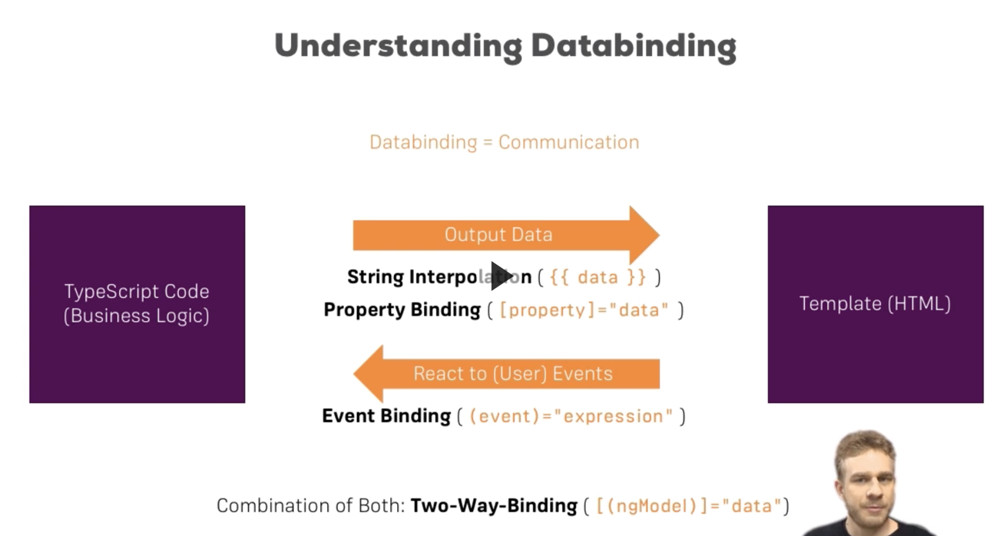

# angular7

## NG CLI Commands

- ng new [name] :  Creates new app
- ng serve : Run a server on ort 4200 which runs the code, if errors about:
    > ERROR in node_modules/rxjs/internal/types.d.ts(81,44): error TS1005: ';' expected.
    
    > then run:

    > **npm audit fix --force**
    
- ng generate component [component-name] : Creates a new component, creates the directpry inside src/app, creates the 
css, html, spec.ts and ts files with a template ready to use and update the `app.module.ts` to include the new component
    > ng g c [component-name] : shortcut
    > ng g c [path]/[component-name] : Creates the component in a nested folder
    > ng g c [component-name] --spec false : avoids creating testing files
    

    
## Adding bootstrap (or other libraries)
 
- npm install --save bootstrap : Adding bootstrap to the project
- Update `angular.json` to add the dependency
 
## Components
 
- Need the decorator `@Component` passing a JS object for configuring
- Need a HTML template (inline or external)
- Need a unique selector
- Ways to reference a component:
  * By Element: Default mode i.e. `<component-name>`
  * By Attribute: When the `selector` is enclosed within `[]` then the component is referenced by attribute i.e. 

  * By class: When the `selector` is prefixed with a `.` then the component is referenced by class i.e. 

## DataBinding

- String Interpolation: We can use anything that resolves as a string
  * {{ variable }}
  * {{ 'STRING' }}
  * {{ method() }} //Must return a string
- Property Binding: Used to change DOM Elements properties, usage: <element `[`propertyToChange`]` = "varToBindiningInTSFile" >, 
note the `propertyToChange` must be enclosed within `[]`
- Event Binding: Used to react to events, usage: <element `(`eventName`)` = "codeToExecute or Function" >, 
note the `eventName` must be enclosed within `()`
- 2-way-Binding: Use `[(ngModel)]` to configure the 2-way-binding, usage: <input `[(ngModel)]="varToPoint"`>

## Directives

- They are instructions on the DOM
- Don't need template
- Tipically use the `attribute` style `[]`
- Use the `@Directive` decorator

### Existing Directives

- *ngIf : Receives any code that resolves as a boolean, usage: 
Show

- Else : For using else we need to add a marker in the DOM enclosing what we want in the else, and add `else markerInDomName` '
after the `*ngIf` condition, usage: `
IF CODE

    <ng-template #noServer>ELSE CODE</ng-template>`
- ngStyle : used binding to a property so use it within `[]`, ie: `

`
- ngClass : Also property binding `[]`, usage: `
`
- *ngFor :  is structural, goes inside the element we want to iterate, usage:
`<elementToRepeat *ngFor="let tempVar of arrayToIterate"></app-server>`. For this example it repeats the Element as 
many times as elements in the array

_Notes: The `*` means is structural directive changing the DOM_

## Communicating among components

- From parent to son:
  > In the parent HTML template do a property binding for the property:
  > `<app-server-element
    *ngFor="let server of servers"
    [serverElement]="server" <------ THIS ONE
    ></app-server-element>`
  > The son component must to have a property called like that and also decorated with @Input()
  > `@Input() serverElement: Server;`
- From son to parent:
  > In the son TS file declare a property decorated with @Output() for emitting an event:
  > `@Output() serverCreated = new EventEmitter<{TypeToSend}>();`
  > When the son needs to send the info to the parent:
  > `addServer() { <-- Method executed by the son
      this.serverCreated.emit({TypeToSend: new TypeToSend(parameters...)});
    }`
  > In the parent HTML, where the son is used, event bind the EventEmitter from son with a methond in the parent:
  > `  <app-cockpit <--Son used in the parent
         (serverCreated)="addServerOnServer($event)" <-- Event binding the serverCreated object in son to addServerOnServer($event) in parent, send the $event to catch the info from son to parent
       ></app-cockpit>` 
  > In the parent TS file declare the method to catch the $event
  > `addServerOnServer(event: any) { <-- Since is a custom type use any
      this.servers.push(new Server(event.TypeToSend.propertyName)); <-- The event has a TypeToSend with the custom properties
    }` 
  
## Local references in templates

- You can add a `#` in any HTML tag to use it in the HTML template
`<input type="text" #serverName>`

- this will give us a local reference to the `<input>` element called serverName

- then it can be used anywhere the HTML template:
`<button (click)="addServer(serverName)">Add Server</button>`

- In the TS code:
`addServer(serverNameInput: HTMLInputElement) {
  console.log(serverNameInput.value);
}`

- This local references are used only in the HTML template
- gives the whole reference of the element, not the value 

## Features

- @ChildView : Allow to use html nodes from the TS file
- <ng-content></ng-content> : Allow to pass information to the template from outside the component

## Component Lifecycle

- ngOnChange: Called after a bound input property (properties decorated with @Input) changes, can be called multiple times
- ngOnInit: Called only once when the component is initialized, run after the constructor
- ngDoCheck: Called when change detection. When angular detects changes on the template
- ngAfterContentInit: Called after the content of ng-content has been projected into the view
- ngAfterContentChecked: Called every time the projected content has been checked
- ngAfterViewInit: Called after the component's view (and child views) has been initialized
- ngAfterViewChecked: Called every time the view (and child views) has been checked
- ngOnDestroy: Called once when the component is about to be destroyed